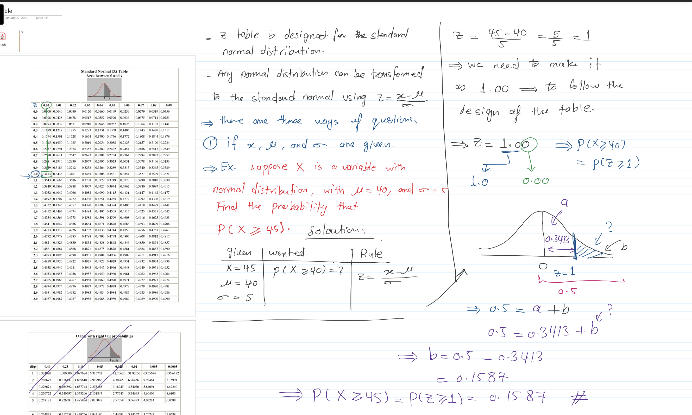

```{r setup, include=FALSE}
knitr::opts_chunk$set(echo = FALSE)
```

- The normal distribution, also known as the Gaussian distribution or bell curve, is a fundamental concept in statistics and probability theory. It describes a continuous probability distribution for a random variable, where the data tends to cluster around the mean value with decreasing frequency as it moves away from the mean.

- The normal distribution is defined by two parameters: the mean ($\mu$) and the standard deviation ($\sigma$). 
The mean represents the center or average value of the distribution, while the standard deviation measures the spread or variability of the data.

- The shape of the normal distribution is symmetric and bell-shaped, with the highest point at the mean. The curve is characterized by the empirical rule, also known as the $68-95-99.7$ rule, which states that:

- Approximately $68\%$ of the data falls within one standard deviation of the mean.
- Approximately $95\%$ of the data falls within two standard deviations of the mean.
- Approximately $99.7\%$ of the data falls within three standard deviations of the mean.

The normal distribution has several important properties that make it widely used in various fields. These include:

- Central Limit Theorem: The sum or average of a large number of independent and identically distributed random variables tends to follow a normal distribution, regardless of the shape of the original distribution. 

- Z-Score: The z-score, also known as the standard score, is a measure of how many standard deviations an observation or data point is away from the mean. It allows for standardized comparisons between different values and is commonly used in hypothesis testing and statistical analysis. Any normal distribution can be converted to the standard normal distribution using the z-score formula:
\begin{equation}
z = \frac{x - \mu}{\sigma}
\end{equation}
- Probability Density Function (PDF): The normal distribution is described by a probability density function, which gives the probability of observing a particular value or range of values. The PDF is defined by the mean and standard deviation parameters.

- When working with the z-table we have three different situations as follows:

- When the $x$, $\mu$ and the $\sigma$ values are given in the question. In this case, we cannot use the z-table directly as 
it is designed for the standard normal distribution. Hence, we first need to transform the normal distribution with the given 
values into standard one using the z-score formula as shown above. The following is an example of this case. 

- 

