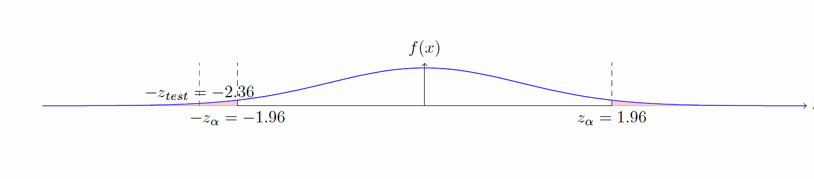

```{r setup, include=FALSE}
knitr::opts_chunk$set(echo = FALSE)
```

# Hypothesis test

Basically, a hypothesis test is a statistical method to test a claim, believes or a status quo. In this page we are interest in the
hypothesis test for a single mean, such that we are interested in one sample. 

## Formulate the hypothesis test

- In hypothesis test, a researcher needs to formulating two competing hypotheses, the null hypothesis ($H_0$) and the alternative hypothesis
($H_a$). After that, he/she needs to use a statistical evidence to evaluate which hypothesis is more likely.

## Population statndard deviation is known

- If the population standard deviation is known ($\sigma$), or we have a large sample size, then we can use the $Z$-Statistics. 

$$Z _\textit{test} = \frac{(\bar{x} - μ)} {(σ / √n)}$$

Where:

- $z$ is the z-statistic
- $\bar{x}$ is the sample mean
- $μ$ is the population mean
- $σ$ is the population standard deviation
- $n$ is the sample size

## Example of using Z-statistics 

- First of all, suppose we need to test the following hypothesis test:

$$H_0: \mu = 200$$
$$H_a: \mu \neq 200$$ 
With $$n = 50, \ \bar{x} = 197, \  \mu = 200, \ \sigma = 9, \ \alpha = 0.05$$

### Solution:

### Is the population standard deviation known? 

- Yes, the population standard deviation is known and given as $\sigma = 9$. 

### Can we use the Z-statistics to test the hypothesis, and why?

- Yes. Because if the population standard deviation is known we can use $Z$-Statistics, also the sample size is large ($n \geq 30$).

### How many rejection area do we have in this case, and why?

- In this case, there are two rejection areas. Because the alternative hypothesis has unequal sign ("$\neq$"). That is, 
the rejection region are determined based on the sign of the alternative hypothesis. 

### Ok. If we have two rejection regions, what we should do with the significant level?

- If we have two rejections areas, then we must divide the significant level ($\alpha$) by $2$. That is: $$\alpha /2 = 0.05/2 = 0.025$$

### Great! What is next?

Now we need to specify the decision rule, as follows:

### Decision Rule:

- Decision rule is just a decision that we made regarding rejecting or fail to reject the null hypothesis ($H_0$). 

- First we need to formulate the decision rule. That is, when we reject $H_0$ and when we fail to reject $H_0$. 

_ To formulate the decision rule, a good idea is to draw a graph and to specify the rejection region, as follows:


- From the above graph, we can see that we have two rejection regions. The cut-off (border) of the rejection region start at 
$Z_{\alpha/2}$ $= 1.96$ at the right side, and at $- Z_{\alpha/2}$ $= - 1.96$ at the left side. That is, the rejection regions are the red areas. 

### Greate! But what does this mean?

(Simply) The rejection region is the area that if the $Z$-statistics or $Z$-test fall in, then we need to reject the null hypothesis. 

### Great! What next?

Now, we need to specify the decision rule. When we reject the $H_0$ and when fail to reject $H_0$ based on the rejection areas as follows:

- $$ If \ Z_{test} > Z_{\alpha/2} = 1.96 \rightarrow \  Reject \ H_0$$

or 

- $$ If \ - Z_{test} < - Z_{\alpha/2} = - 1.96 \rightarrow \  Reject \ H_0$$

- Otherwise do not reject $H_0$. 

### Explaining the Decision rule

- $$ If \ Z_{test} > Z_{\alpha/2} = 1.96 \rightarrow \  Reject \ H_0$$

- This part of the decision rule said that: If the value of the $Z_{test}$ larger than the right border of the rejection area, 
then we need to reject the $H_0$. 

- Ok. But why? That is because it falls inside the rejection area!

- Ok. How about the left hand-side? The same situation. That is: 

- $$ If \ - Z_{test} < - Z_{\alpha/2} = - 1.96 \rightarrow \  Reject \ H_0$$

This part of the decision rule said that: If the value of the $- Z_{test}$ smaller than the left border of the rejection area, 
then we need to reject the $H_0$. Because it falls inside the rejection area. 

### Great! So we should compare the Z-test with the critical value. 

The graph shows the value of the $- Z_{test} = -2.36$. From the graph, the $- Z_{test} = -2.36$ falls inside the left 
rejection area. 

### Ok. What does this means?

As explained above, it means that the $- Z_{test} = -2.36$ is smaller than the $- Z_{\alpha/2} = -1.96$. In other words, the $- Z_{test}$ is inside the
rejection region. Hence, based on the decision rule, we need to reject $H_0$. 



### Conclusion 

Because the $Z_{test} = -2.36$ is smaller than the $Z_{\alpha/2}= -1.96$, and hence falls in the rejection region, we reject $H_0$, and conclude that, the population mean is not equal to $200$. Because we reject $H_0$. 


